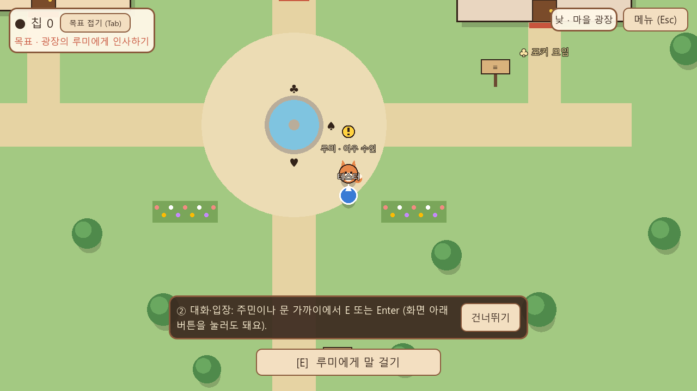
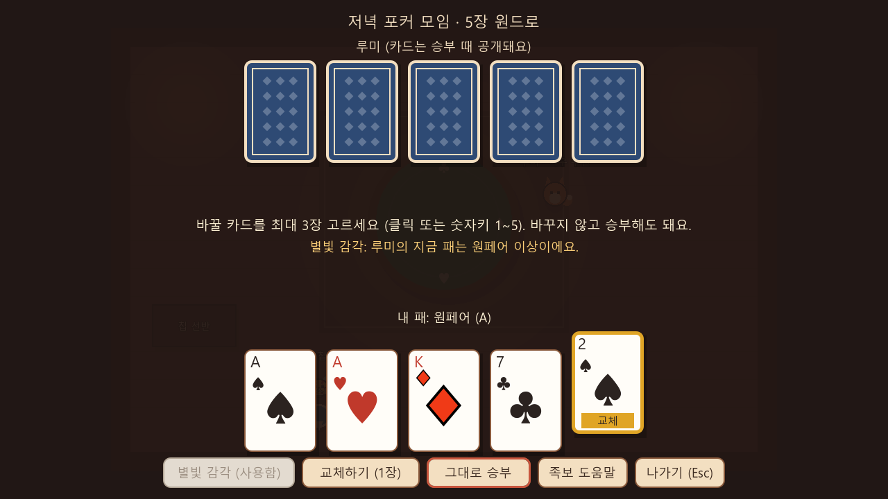
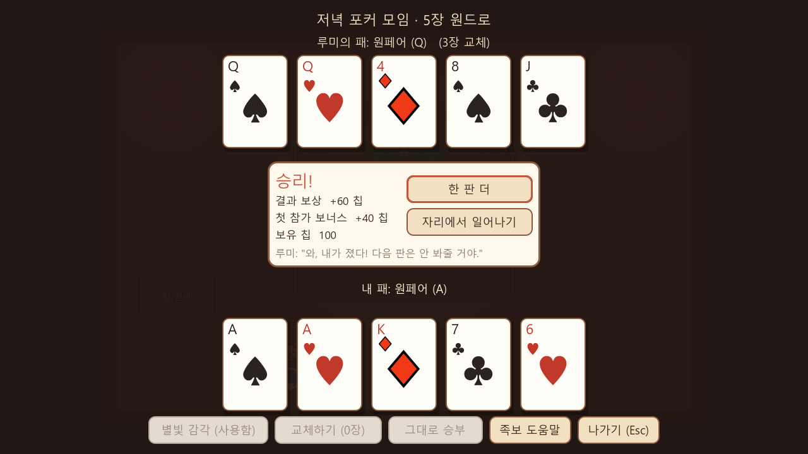
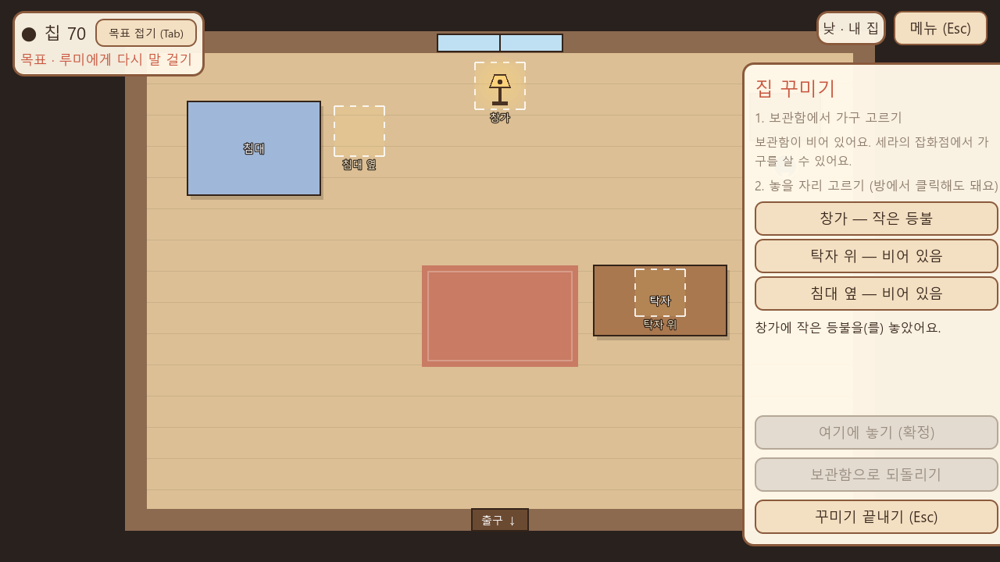

# Pokerstory (Project 20)

> 정식 게임명은 아직 정해지지 않았습니다. 저장소 이름 `Pokerstory`와 작업명 "Project 20"은 임시 명칭입니다.

포커가 일상 문화인 따뜻한 판타지 마을에서 생활하고 주민들과 관계를 맺으며, 짧은 판타지 포커를 즐기는 게임입니다.



## 현재 단계

| 항목 | 상태 |
|---|---|
| 콘셉트 결정(10개 질문) | 기록 완료 ([v0.1](docs/Project20_Design_Brief_v0.1.md)) |
| 사전 제작 기술 조사 | 완료 ([docs/preproduction/](docs/preproduction/)) |
| 첫 플레이 명세 | [v0.2 초안](docs/design/Project20_First_Play_Spec_v0.2.md) |
| **첫 플레이 프로토타입 (Gate 1)** | **구현 및 자동 검증 완료.** 그레이박스 그래픽 |
| Gate 2 (플레이어 시각 검수) | 대기 중 |

첫 플레이에서 할 수 있는 것: 마을 도착 → 루미와 인사 → 저녁 카드룸에서 5장 원드로 포커 → 칩 획득 → 세라의 잡화점에서 등불 구매 → 집에 배치 → 루미가 등불을 알아봄 → 저장·이어하기.
개발 내용, 검증 결과, 명세와 다르게 구현한 부분: [docs/dev/FIRST_PLAY_BUILD_NOTES.md](docs/dev/FIRST_PLAY_BUILD_NOTES.md)

## 실행

1. [Godot 4.7.2](https://github.com/godotengine/godot/releases/tag/4.7.2-stable)의 `Godot_v4.7.2-stable_win64.exe.zip`을 받습니다.
2. `run_game.bat`을 실행하거나, `Godot_v4.7.2-stable_win64.exe --path game`으로 실행합니다. 경로가 다르면 `GODOT` 환경 변수를 지정합니다.

조작: WASD·방향키 이동 / E·Enter 대화·입장 / Esc 메뉴 / Tab 목표 접기 / 마우스로 카드·가구 선택

테스트: `tools/run_tests.sh` (Git Bash). 단위 테스트 41개와 첫 플레이 전체를 자동으로 조작하는 E2E 7개 시나리오를 실행합니다.

## 스크린샷

| 포커 | 결과 | 집 꾸미기 |
|---|---|---|
|  |  |  |

## 문서

| 문서 | 내용 |
|---|---|
| [Project20_Design_Brief_v0.1.md](docs/Project20_Design_Brief_v0.1.md) | 콘셉트 결정 (Source of Truth) |
| [design/Project20_First_Play_Spec_v0.2.md](docs/design/Project20_First_Play_Spec_v0.2.md) | 첫 플레이 명세 (기획 담당) |
| [dev/FIRST_PLAY_BUILD_NOTES.md](docs/dev/FIRST_PLAY_BUILD_NOTES.md) | 구현 구조, 저장 형식, 검증 결과, 알려진 문제 |
| [preproduction/](docs/preproduction/) | 엔진·그래픽·시스템·워크플로 조사, 기획 결정 필요 사항 |
| [CLAUDE.md](CLAUDE.md) | AI 개발 규칙 |

## 저장소 구성

```
.
├─ game/            Godot 4.7.2 프로젝트 (data/ 콘텐츠, scripts/ 코드, tests/ 테스트)
├─ docs/            기획·조사·개발 문서, 스크린샷
├─ tools/           테스트 실행 스크립트
├─ run_game.bat     Windows 실행
└─ CLAUDE.md        AI 작업 규칙
```

## 아직 정해지지 않은 것

정식 게임명, 최종 그래픽 스타일(현재는 그레이박스), 포커 룰 최종안, 경제 밸런스, 관계 시스템, 전역 시간, 추가 주민·공간, 모바일·Steam 대응. 모두 기획 측 결정과 별도 작업 지시가 있어야 진행합니다.
