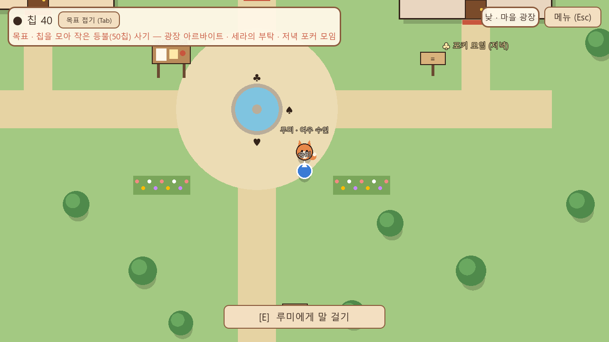
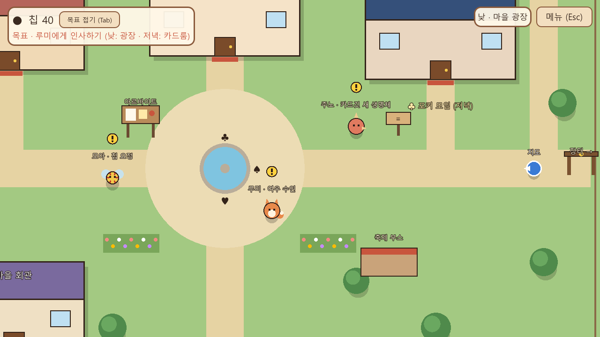
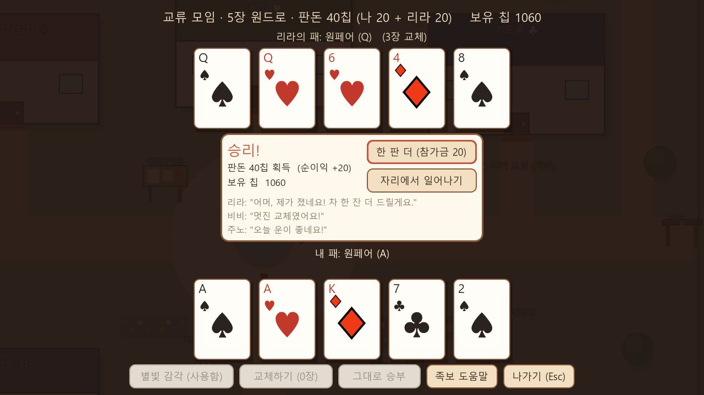
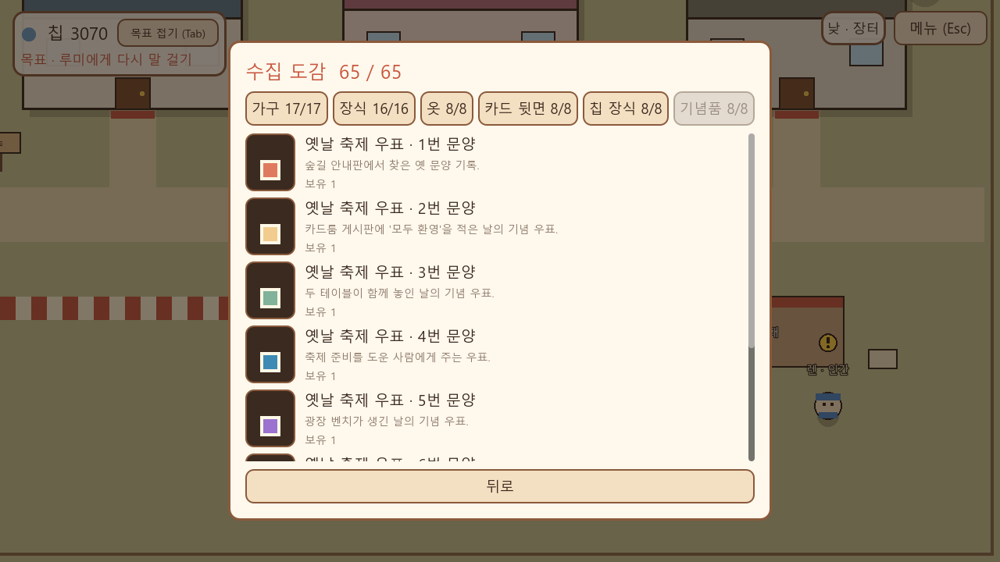
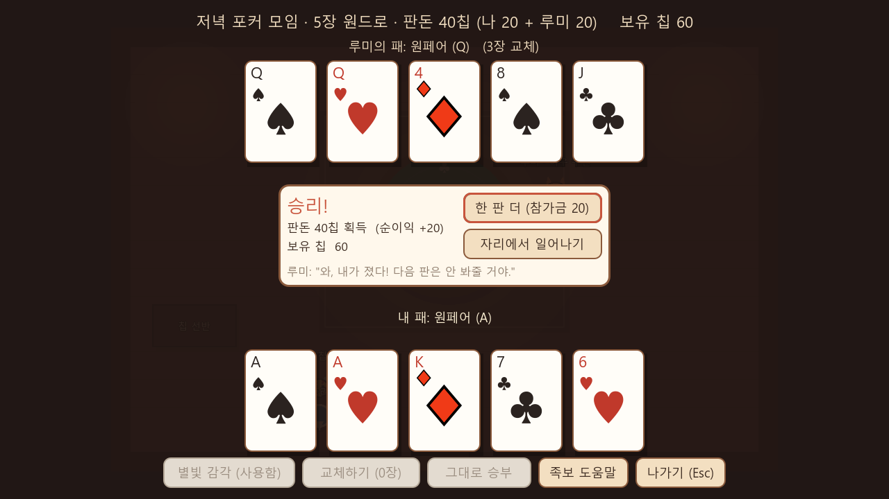
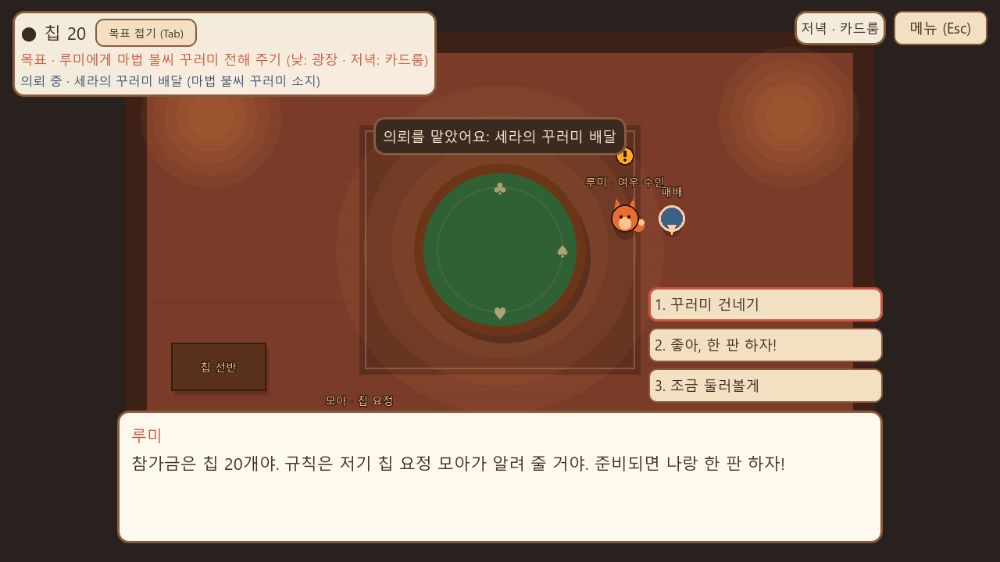
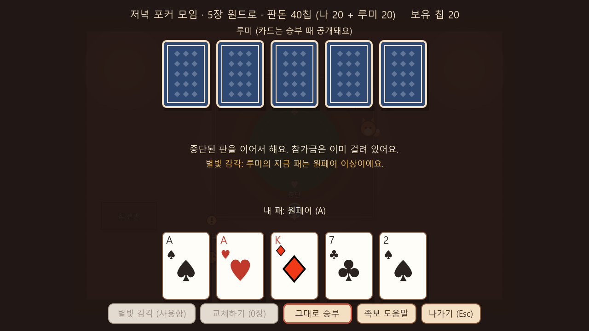
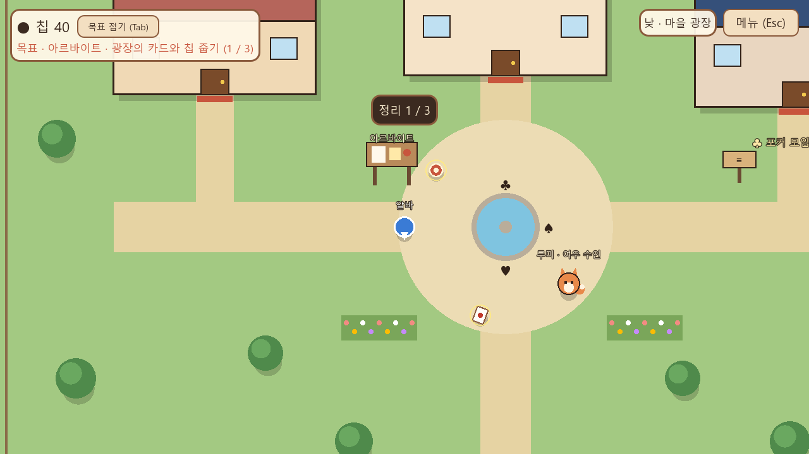
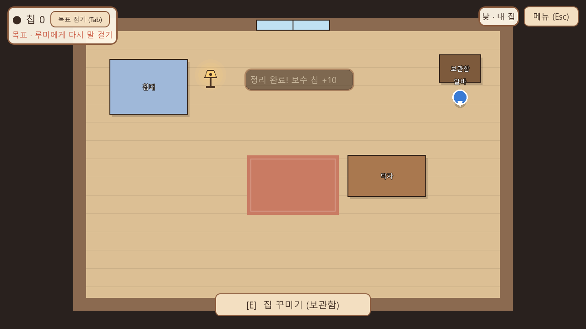

# Pokerstory (Project 20)

> 정식 게임명은 아직 정해지지 않았습니다. 저장소 이름 `Pokerstory`와 작업명 "Project 20"은 임시 명칭입니다.

포커가 일상 문화인 따뜻한 판타지 마을에서 생활하고 주민들과 관계를 맺으며, 짧은 판타지 포커를 즐기는 게임입니다.



## 현재 단계

| 항목 | 상태 |
|---|---|
| 콘셉트 결정(10개 질문) | 기록 완료 ([v0.1](docs/Project20_Design_Brief_v0.1.md)) |
| 사전 제작 기술 조사 | 완료 ([docs/preproduction/](docs/preproduction/)) |
| 첫 플레이 명세 | [v0.2 초안](docs/design/Project20_First_Play_Spec_v0.2.md) |
| 설계 수정 02 / 경제 v0.2.1 | [수정 기록](docs/design/Project20_Design_Correction_02.md), [경제 (승인)](docs/design/Project20_Economy_v0.2.1.md) |
| 설계 검토 03 / 경제 v0.2.2 | [검토 03 기록](docs/design/Project20_Design_Review_03.md) (승인됨) |
| 설계 검토 04 | [검토 04 기록](docs/design/Project20_Design_Review_04.md) — R1·R2 승인, Gate 2 준비 |
| 첫 플레이 프로토타입 | 검토 04 반영 및 자동 검증 완료 |
| **콘텐츠 v0.3 (1~6단계)** | **브랜치 `feature/content-v0.3`에서 구현·자동 검증 완료 — [구현 기록과 cc01~cc12 보고](docs/dev/CONTENT_V0.3_IMPLEMENTATION_LOG.md).** 임시 도형 그래픽, 수동 완주 검수 대기 |

첫 플레이에서 할 수 있는 것: 칩 40개로 시작 → 광장의 루미와 인사 → 등불(50칩)을 사려면 저녁 카드룸 포커(참가금 20, 승리 시 40 반환), 세라의 배달 의뢰(+30), 광장 아르바이트(+10, 반복 가능) 중 원하는 방법으로 칩 모으기 → 등불 구매·배치 → 루미가 등불을 알아봄 → 저장·이어하기(진행 중인 포커 판도 그대로 이어짐).
개발 내용, 검증 결과, 명세와 다르게 구현한 부분: [docs/dev/FIRST_PLAY_BUILD_NOTES.md](docs/dev/FIRST_PLAY_BUILD_NOTES.md)

## 실행

1. [Godot 4.7.2](https://github.com/godotengine/godot/releases/tag/4.7.2-stable)의 `Godot_v4.7.2-stable_win64.exe.zip`을 받습니다.
2. `run_game.bat`을 실행하거나, `Godot_v4.7.2-stable_win64.exe --path game`으로 실행합니다. 경로가 다르면 `GODOT` 환경 변수를 지정합니다.

조작: WASD·방향키 이동 / E·Enter 대화·입장 / Esc 메뉴 / Tab 목표 접기 / 마우스로 카드·가구 선택

콘텐츠 v0.3에서는 마을 지구 5곳과 주민 16명, 3막 이야기와 후일담, 주민 사건·의뢰·아르바이트, 집 확장, 공공사업, 수집 도감, 포커 테이블 여러 종류와 축제 대회가 추가됩니다. 이야기는 포커를 한 판도 하지 않고 끝까지 진행할 수 있습니다.

테스트: `tools/run_tests.sh` (Git Bash). 단위 테스트 94개와, 게임을 자동으로 조작하는 E2E 19개 시나리오(첫 플레이 경로 A~D, 콘텐츠 검수 cc01~cc12, 생활, 상호 반응)를 실행합니다.

| 광장 | 교류 모임 | 수집 도감 |
|---|---|---|
|  |  |  |

## 스크린샷

| 포커 결과 | 첫 만남 + 꾸러미 전달 | 중단된 판 이어하기 |
|---|---|---|
|  |  |  |

| 광장 아르바이트 | 집 꾸미기 |
|---|---|
|  |  |

## 문서

| 문서 | 내용 |
|---|---|
| [Project20_Design_Brief_v0.1.md](docs/Project20_Design_Brief_v0.1.md) | 콘셉트 결정 (Source of Truth) |
| [design/Project20_First_Play_Spec_v0.2.md](docs/design/Project20_First_Play_Spec_v0.2.md) | 첫 플레이 명세 (기획 담당) |
| [design/Project20_Economy_v0.2.1.md](docs/design/Project20_Economy_v0.2.1.md) | 칩 경제 (승인 확정값) |
| [design/Project20_Design_Correction_02.md](docs/design/Project20_Design_Correction_02.md) | 설계 수정 02: 불일치, 변경 내용, 기획 확인 요청 |
| [design/Project20_Design_Review_03.md](docs/design/Project20_Design_Review_03.md) | 설계 검토 03: D1~D7 결정, Economy v0.2.2, 포커 판 복원 방식 |
| [design/Project20_Design_Review_04.md](docs/design/Project20_Design_Review_04.md) | 설계 검토 04: R1·R2 승인과 조건 반영 |
| [dev/FIRST_PLAY_BUILD_NOTES.md](docs/dev/FIRST_PLAY_BUILD_NOTES.md) | 구현 구조, 저장 형식, 검증 결과, 알려진 문제 |
| [design/content_v0.3/](docs/design/content_v0.3/) | 콘텐츠 기획 팩 v0.3 (원본) |
| [dev/CONTENT_V0.3_IMPLEMENTATION_LOG.md](docs/dev/CONTENT_V0.3_IMPLEMENTATION_LOG.md) | 콘텐츠 v0.3 구현 기록, 호환 결정, cc01~cc12 결과, 미완료 |
| [preproduction/](docs/preproduction/) | 엔진·그래픽·시스템·워크플로 조사, 기획 결정 필요 사항 |
| [CLAUDE.md](CLAUDE.md) | AI 개발 규칙 |

## 저장소 구성

```
.
├─ game/            Godot 4.7.2 프로젝트 (data/ 콘텐츠, scripts/ 코드, tests/ 테스트)
├─ docs/            기획·조사·개발 문서, 스크린샷
├─ tools/           테스트 실행 스크립트
├─ run_game.bat     Windows 실행
└─ CLAUDE.md        AI 작업 규칙
```

## 아직 정해지지 않은 것

정식 게임명, 최종 그래픽 스타일(현재는 그레이박스), 포커 룰 최종안, 관계 시스템, 주민 스케줄, 추가 주민·공간, 모바일·Steam 대응. 모두 기획 측 결정과 별도 작업 지시가 있어야 진행합니다.
