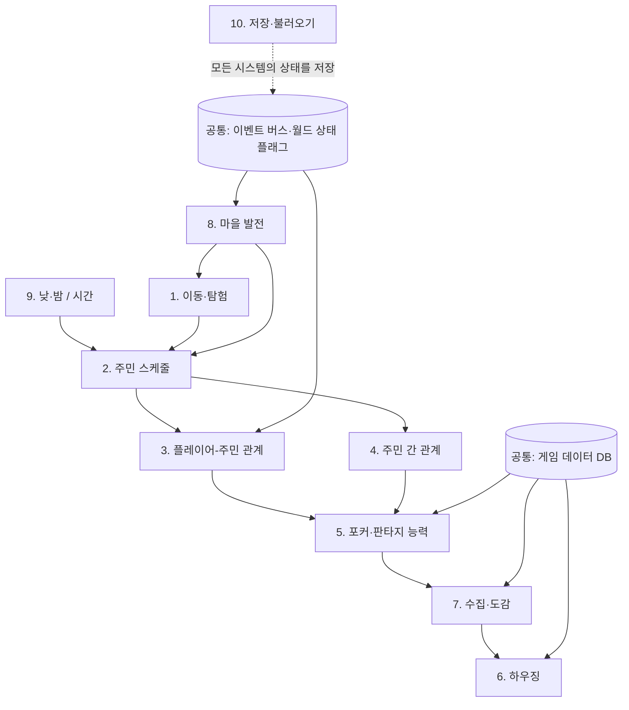

# 03. 핵심 시스템 기술 검토

| 항목 | 내용 |
|---|---|
| 문서 상태 | 사전 제작 조사 자료 (결정 문서 아님) |
| 작성 | Claude (개발 담당) |
| 작성일 | 2026-09-25 |
| 기준 문서 | [Project20_Design_Brief_v0.1.md](../Project20_Design_Brief_v0.1.md) |

**표기 규칙:** [조사] 기술 사실·일반적 구현 방식 / [권고] 개발 담당 의견 / [미정] 기획 결정 대기

> 이 문서는 시스템의 **규칙을 정하지 않습니다.** 규칙이 정해졌을 때 어떤 기술이 필요한지, 무엇이 어려운지만 설명합니다. 예시로 든 방식은 선택지이며 제안된 규칙이 아닙니다.

---

## 0. 시스템 의존 관계 개요

**기반 시스템 (먼저 필요):** 게임 데이터 DB, 이벤트 버스·월드 상태 플래그, 시간(9), 저장(10)의 기본 구조, 이동(1).
**의존도가 높은 시스템 (나중에 붙음):** 주민 간 관계(4), 마을 발전(8). 둘 다 다른 시스템 대부분이 있어야 의미가 생깁니다.

### 난이도 요약 [개발 담당 평가]

| # | 시스템 | 기술 난이도 | 콘텐츠 제작량 | 주요 위험 |
|---|---|---|---|---|
| 1 | 이동·탐험 | 낮음 | 중간 (맵) | 입력 방식이 여러 개 (키보드, 패드, 터치) |
| 2 | 주민 스케줄 | **높음** | 높음 | 화면 밖 시뮬레이션, 경로 막힘 |
| 3 | 플레이어-주민 관계 | 중간 | **매우 높음** | 대화 분량이 폭발적으로 늘어남 |
| 4 | 주민 간 관계 | **높음** | 높음 | 조합 수 폭발, 플레이어가 알아차리게 만들기 |
| 5 | 포커·능력 | 중간 | 중간 | 공정성 인식, **등급·법규** |
| 6 | 하우징 | 중간~높음 (그래픽 방식에 따라) | 높음 (가구) | 깊이 정렬(아이소), 터치 조작 |
| 7 | 수집·도감 | 낮음 | 높음 | ID 관리, 아이콘 수 |
| 8 | 마을 발전 | 중간 | 중간 | 월드 상태 조합, 세이브 호환 |
| 9 | 낮·밤 | 낮음~중간 | 낮음 | 현실 날짜 연동 이벤트 |
| 10 | 저장·불러오기 | 중간 | 없음 | 버전 호환(마이그레이션), 모바일 강제 종료 |

---

## 1. 마을 탐험과 캐릭터 이동

**주요 기술 [조사]**
- 캐릭터 컨트롤러(물리 바디 + 충돌), 타일맵 또는 3D 지형 충돌
- 입력을 추상화하는 계층. 게임 로직은 "이동", "상호작용" 같은 액션만 받고, 키보드·게임패드·터치 처리는 따로 둡니다.
- 카메라 추적과 경계 제한
- 씬 전환(마을 ↔ 실내), 출입 지점 관리
- 모바일용 탭 이동을 넣을 경우 경로 탐색(내비게이션)

**의존 관계**
- 선행: 그래픽 방식(02 문서), 맵 데이터 형식
- 후행: 주민 스케줄(2), 마을 발전(8)(지형과 건물이 바뀜), 하우징(6)(실내 이동)

**난이도를 높이는 요소**
- PC(키보드·패드)와 모바일(터치)의 조작감을 모두 만족시키는 것. 특히 탭 이동과 직접 이동을 함께 지원하면 상호작용 대상 판정이 복잡해집니다.
- 실내외 전환 방식([미정]): 씬 분리 방식이면 NPC를 화면 밖에서 처리해야 합니다(2절).
- 아이소메트릭 방식이면 입력 방향과 화면 방향이 어긋나는 문제를 보정해야 합니다.

**확장 시 주의**
- 기획서 Q8에 따라 외부 지역은 초기 범위가 아니지만, 씬 전환 구조를 "마을 하나"에 딱 맞춰 하드코딩하면 나중에 지역을 추가할 때 다시 만들어야 합니다. 지역 ID와 출입 지점 데이터를 처음부터 일반화해 두는 것이 저렴합니다.

---

## 2. 주민의 일상 행동과 스케줄

**주요 기술 [조사]**
- 시간 시스템(9)과 연동되는 스케줄 데이터. 예: "요일·시간대·날씨 → 목표 장소·행동"
- 행동 결정 구조. 선택지는 유한 상태 기계(FSM), 행동 트리, 유틸리티 AI이며, 복잡도에 따라 고릅니다.
- 경로 탐색과 회피(NavigationAgent 등)
- **화면 밖 시뮬레이션:** 플레이어가 없는 씬에 있는 주민의 위치와 상태를 가볍게 계산하는 추상 모델
- 상호작용이 들어오면 스케줄을 잠시 멈추고, 끝나면 다시 이어가는 처리

**의존 관계**
- 선행: 시간(9), 이동·내비게이션(1), 맵
- 후행: 관계(3, 4)(누가 언제 어디서 만나는지), 포커(5)(밤 모임 참여자), 마을 발전(8)(새 시설로 새 목적지가 생김)

**난이도를 높이는 요소**
- **씬이 분리된 경우, 화면 밖 주민 처리:** 플레이어가 가게에 들어갔다 나오면 주민이 있어야 할 위치에 있어야 합니다. 실제 이동을 시뮬레이션하지 않고 "시간 기준으로 위치를 계산"하는 방식이 일반적이지만, 씬에 들어간 순간 계산된 위치와 실제 경로가 맞지 않는 문제가 생깁니다.
- 주민이 문, 좁은 길, 플레이어에게 막히는 문제. 막혔을 때 순간이동할지 기다릴지 같은 예외 처리가 필요합니다.
- 주민 수 × 스케줄 변형(요일, 날씨, 이벤트, 관계 상태) 조합이 늘어나면서 테스트가 어려워집니다.
- 기획서 2절의 "각자의 생활을 가진 존재"를 **플레이어가 느끼게 만드는 연출** 문제. 스케줄이 있어도 눈에 띄지 않으면 체감되지 않습니다.

**확장 시 주의**
- 스케줄은 코드가 아니라 데이터로 작성해야 주민을 추가할 때 코드를 바꾸지 않습니다.
- 개발용 디버그 도구(시간 빨리 감기, 모든 주민 위치 표시)가 없으면 검증이 거의 불가능합니다. 시스템 구현과 함께 만들어야 합니다.
- 여러 날을 자동 시뮬레이션하는 테스트(예: "30일 동안 주민이 막히지 않는가")를 초기부터 갖추기를 권합니다.

---

## 3. 플레이어와 주민의 관계 시스템

기획서 Q6: 우정, 라이벌·동료, 연애를 모두 포함하는 방향입니다. 구현 세부는 [미정]입니다.

**주요 기술 [조사]**
- 관계 상태 모델([미정]). 선택지 예: 단일 수치, 여러 축 수치(친밀·신뢰·경쟁 등), 단계형 상태, 플래그 조합
- 조건 분기 대화 시스템. 관계 상태, 시간, 장소, 월드 플래그를 조건으로 씁니다.
- 이벤트(컷신) 트리거와 연출(초상화, 감정 아이콘, 카메라)
- 관계 변화를 플레이어에게 보여 주는 UI

**의존 관계**
- 선행: 대화 시스템, 이벤트 버스, 주민 스케줄(2)(어디서 만날 수 있는지)
- 후행: 포커(5)(관계가 대전·능력에 영향을 줄 경우 [미정]), 마을 발전(8), 수집(7)(주민 기념품 [미정])

**난이도를 높이는 요소**
- **콘텐츠 분량이 기술보다 큰 병목입니다.** 관계 유형(우정·라이벌·연애)마다 단계별 대사와 이벤트가 필요하고, 그 양은 주민 수에 비례해 늘어납니다.
- 연애를 포함하면 대상 선정, 동시 연애 여부, 관계 해소 규칙 같은 규칙이 필요하고, 다른 주민의 반응(4)까지 연결됩니다. 모두 [미정]입니다.
- 반복 대사 문제: 같은 대사가 반복되면 "살아 있는 주민" 느낌이 무너집니다.
- 다국어 지원을 할 경우 대사량만큼 번역 비용이 늘어납니다.

**확장 시 주의**
- 대화 데이터를 엔진 중립 형식(Yarn, Ink, JSON 등)으로 두고 대사마다 고유 ID를 붙여야, 나중에 번역·음성·수정 추적이 가능합니다.
- 관계 상태 모델은 **세이브 데이터 구조가 됩니다.** 출시 후 모델을 바꾸면 세이브 마이그레이션이 필요합니다.

---

## 4. 주민 사이의 관계 시스템

기획서 Q6-D: 주민 간 자율적 관계와 공동체 방향입니다. 구현 세부는 [미정]입니다.

**주요 기술 [조사]**
- 관계 그래프 자료구조(주민 쌍마다 상태 보관)
- 관계 변화 규칙: 미리 짜 둔 이벤트, 조건부 자동 변화, 또는 둘의 혼합 ([미정])
- 주민끼리 만나는 상황 만들기(스케줄과 연동)
- 플레이어에게 드러내는 장치: 주민끼리의 대화, 소문, 게시판, 포커 모임 구성 등

**의존 관계**
- 선행: 주민 스케줄(2), 플레이어 관계(3)의 데이터 모델, 이벤트 버스
- 후행: 포커(5)(누가 누구와 게임을 하는지), 마을 발전(8)

**난이도를 높이는 요소**
- **조합 수 폭발:** 주민 N명이면 쌍은 N×(N−1)/2개입니다. 10명이면 45쌍, 20명이면 190쌍, 30명이면 435쌍입니다. 쌍마다 콘텐츠를 만드는 방식은 규모를 키울 수 없습니다.
- **자동 변화 방식의 위험:** 규칙만으로 관계가 바뀌면 이야기로 설명되지 않는 상태가 생기기 쉽습니다(예: 설정상 가족인데 경쟁 관계). 제약 조건과 금지 조합이 필요합니다.
- **보이지 않는 시스템 문제:** 화면 밖에서 관계가 바뀌어도 플레이어가 모르면 구현 비용만 들고 체감 효과가 없습니다.
- 플레이어가 개입해서 관계를 바꿀 수 있게 할지 여부([미정])에 따라 복잡도가 크게 달라집니다.

**확장 시 주의**
- 초기에는 "미리 짠 관계 + 소수의 조건부 이벤트"로 시작하고 자동 변화 규칙은 나중에 추가하는 편이 위험이 적습니다(기술적 관점, [권고]).
- 여러 날 자동 시뮬레이션으로 관계 분포를 확인하는 도구가 필요합니다.

---

## 5. 캐주얼 포커와 판타지 능력

기획서 Q5: 판타지 능력이 더해진 짧고 캐주얼한 포커입니다. 텍사스 홀덤을 엄격히 재현할지는 [미정]입니다. 기본 룰, 승패·보상, 능력 효과, 플레이 시간은 모두 [미정]입니다.

**주요 기술 [조사]**
- 카드·덱 모델과 셔플. 테스트에서 결과를 재현할 수 있도록 시드를 지정할 수 있는 난수 생성기가 필요합니다.
- 핸드 판정기(표준 족보를 쓸 경우). 검증된 알고리즘이 있고 단위 테스트로 완전히 검증할 수 있습니다.
- 게임 진행 상태 기계(딜 → 베팅 라운드 → 공개 → 정산. 구조는 룰에 따라 다름)
- **능력 시스템:** 게임 상태에 끼어드는 지점(예: 딜 이후, 베팅 이전)을 정의하고, 능력은 데이터로 작성한 효과로 구현하는 구조
- AI 상대: 주민 성격과 연결된 의사결정(공격성, 블러프 빈도 등을 수치로 조절). 규칙 기반과 확률 기반을 섞는 것이 일반적입니다.
- 카드 UI 연출(트윈, 뒤집기, 칩 이동)과 모바일 터치 UI

**의존 관계**
- 선행: 게임 데이터 DB(능력·상대 정의), 관계(3, 4)(누가 상대가 되는지, 관계에 따른 반응)
- 후행: 수집(7)(카드 덱·칩 수집 [미정]), 관계 변화, 마을 이벤트

**난이도를 높이는 요소**
- **공정성 인식:** 무작위 결과가 불리하게 연속되면 "조작"으로 느낍니다. 판타지 능력이 공개 정보를 바꾸면 규칙 설명과 UI가 복잡해집니다.
- **능력 조합 폭발:** 능력끼리 상호작용하면 경우의 수가 크게 늘어납니다. 자동 시뮬레이션(수천 판 자동 대전)으로 균형을 확인해야 합니다.
- **AI 상대의 "성격"과 "강함"을 분리하는 것:** 캐주얼 게임에서는 최적으로 두는 AI보다 성격이 보이는 AI가 중요하지만, 너무 약하면 긴장감이 없습니다.
- **등급·법규 위험 (가장 중요한 비기술 위험) [조사]:**
  - 한국 게임물관리위원회는 사행성 모사를 등급 분류 기준으로 봅니다. 통상적인 포커 규칙과 이미지는 사행 행위 모사의 예외로 보는 규정이 있지만, 포커 족보를 쓴 게임(발라트로)이 청소년이용불가 판정 후 15세로 재조정된 사례처럼 판단이 일정하지 않습니다.
  - PEGI(유럽)는 2020년 이후 카지노식 도박을 모사한 신규 게임을 PEGI 18로 분류하는 기준을 두고 있습니다.
  - **현금으로 산 재화를 포커에 걸 수 있게 하거나, 포커로 얻은 것을 현금 가치로 바꿀 수 있게 하면** 등급이 크게 오르고 사행성 규제 대상이 될 수 있습니다. 앱스토어와 구글 플레이도 도박 모사 게임에 별도 정책을 둡니다.
  - 기획서의 방향(포커는 생활 문화이자 관계 수단)은 이 위험을 줄이는 쪽이지만, 재화·과금 설계([미정])가 등급을 결정합니다.

**확장 시 주의**
- 룰 엔진을 UI와 완전히 분리하면 룰 변형(홀덤, 간소화 룰, 이벤트 룰)을 추가하기 쉽습니다.
- 능력은 "효과 데이터 + 발동 시점" 형식으로 정의해야 능력을 추가할 때 코드를 바꾸지 않습니다.

---

## 6. 집 꾸미기와 가구 배치

기획서 Q7-A: 개인 주택과 꾸미기입니다. 배치 규칙은 [미정]입니다.

**주요 기술 [조사]**
- 배치 격자(칸 단위 점유 맵), 가구 크기와 회전 정보
- 배치 가능 여부 판정: 겹침, 벽, 문 앞 통로, 쌓기 가능 여부
- 레이어: 바닥, 바닥 가구, 벽 부착, 테이블 위 소품
- 편집 모드 UI: 선택, 이동, 회전, 보관함으로 되돌리기, 실행 취소
- 배치 상태 저장(가구 ID + 위치 + 회전 + 변형)
- 2D 방식이면 깊이 정렬, 3D 방식이면 콜라이더와 스냅

**의존 관계**
- 선행: 그래픽 방식(02 문서), 아이템 DB(7), 저장(10)
- 후행: 마을 발전(8)(집 확장 [미정]), 관계(3)(주민 방문 반응 [미정])

**난이도를 높이는 요소**
- 그래픽 방식에 따라 난이도 차이가 큽니다. 아이소메트릭 2D에서 가장 어렵습니다(02 문서 3.6절).
- 모바일 터치: 작은 가구 선택, 드래그 중 화면 이동, 회전 조작
- 가구 수가 많아질 때의 성능(특히 모바일 2D에서 정렬 비용, 3D에서 드로우콜)
- 주민이 집에 방문하는 경우([미정]) 배치된 가구 사이로 경로 탐색이 필요합니다.

**확장 시 주의**
- 저장 형식을 가구 "종류 ID" 기반으로 두어야 가구 그림이나 크기를 바꿔도 세이브가 깨지지 않습니다. 가구 크기를 줄이거나 늘리면 기존 배치가 겹칠 수 있으므로 불러오기 시 검증과 보정이 필요합니다.
- 주민 집이나 마을 광장 꾸미기로 확장할 가능성이 있다면 "공간 ID별 배치 데이터" 구조로 일반화해 둡니다.

---

## 7. 아이템 수집과 도감

기획서 Q7-E: 수집입니다. 카테고리와 획득 경로는 [미정]입니다.

**주요 기술 [조사]**
- 아이템 정의 DB(고유 ID, 카테고리, 이름·설명 키, 아이콘 경로, 속성)
- 인벤토리(보유 수량), 도감(발견 여부, 최초 획득일 등)
- 획득 경로 연결: 포커 보상, 주민 선물, 상점, 이벤트 ([미정])
- 도감 UI(필터, 정렬, 미발견 표시)

**의존 관계**
- 선행: 게임 데이터 DB, 저장(10)
- 후행: 하우징(6)(가구는 아이템의 한 종류), 포커(5)(덱·칩), 관계(3)(선물), 마을 발전(8)

**난이도를 높이는 요소**
- 기술적으로는 쉽지만 **아이템 수만큼 아이콘과 설명이 필요합니다.**
- **ID 안정성:** 출시 후 아이템 ID를 바꾸거나 지우면 세이브가 깨집니다. ID 정책을 처음부터 정해야 합니다.
- 기획서 Q9(놓친 이벤트의 영구 소실 지양)에 따라 한정 수집품을 다시 얻을 경로가 필요합니다. 이것은 규칙 문제이고 규칙은 [미정]입니다.

**확장 시 주의**
- 아이템 DB는 스프레드시트 → 내보내기 → 게임 데이터 파이프라인으로 관리하면 기획 측에서 직접 편집할 수 있습니다(04 문서).

---

## 8. 마을 시설 해금과 발전

기획서 Q7-D: 마을 발전입니다. 발전 규칙, 시설 목록, 해금 조건은 [미정]입니다. 기획서상 경영 게임은 아닙니다.

**주요 기술 [조사]**
- 월드 상태 플래그와 진행 단계 데이터
- 조건부 맵 콘텐츠: 플래그에 따라 건물, 장식, NPC, 대화가 바뀜
- 해금 조건 평가기(조건식 데이터)
- 변화 연출(공사 중 → 완공 등)

**의존 관계**
- 선행: 거의 모든 시스템(해금 조건의 입력값), 이벤트 버스, 저장
- 후행: 이동(1)(맵 변화), 주민 스케줄(2)(새 목적지), 관계(3)(새 대화)

**난이도를 높이는 요소**
- **월드 상태 조합 수:** 해금 순서가 자유로우면 가능한 마을 상태 조합이 급격히 늘어나 테스트 부담이 커집니다.
- 맵이 바뀌면 주민 경로와 스케줄 데이터가 깨질 수 있습니다.
- 이미 저장된 세이브에 새 해금 단계를 추가하는 업데이트(출시 후 콘텐츠 추가)의 호환성

**확장 시 주의**
- 해금 조건과 결과를 데이터로 정의하고, 월드 상태를 "플래그 목록"으로 저장하면 업데이트 호환성이 좋아집니다.
- 디버그용 "상태 강제 설정" 도구가 필요합니다.

---

## 9. 낮과 밤의 전환

기획서 Q4, Q9: 낮의 일상과 밤의 포커는 분위기 구분이고, 시간 제한 규칙이 아닙니다. 시간에 쫓기지 않는 자유로운 생활, 현실 날짜 연계 이벤트 가능성, 놓친 이벤트의 영구 소실 지양이 방향입니다. **시간의 실제 진행 로직은 [미정]입니다.**

**시간 모델 선택지와 기술적 영향 [조사]** (결정은 기획 측)

| 모델 | 설명 | 기술적 영향 |
|---|---|---|
| 게임 내 시계 | 현실 N분 = 게임 1일 | 스케줄 구현이 쉽습니다. "쫓기지 않는" 느낌과 충돌할 수 있어 조정이 필요합니다. |
| 플레이어 주도 진행 | 잠자기·행동으로 시간대가 넘어감 | 쫓기는 느낌이 없습니다. 주민 스케줄을 시간대 단위로 단순화할 수 있습니다. |
| 현실 시간 동기화 | 현실 시각 = 게임 시각 | 현실감이 큽니다. 플레이어의 생활 시간에 따라 밤 콘텐츠를 못 보는 문제가 생깁니다. |
| 혼합 | 예: 게임 내 시계 + 현실 날짜 이벤트 | 가장 유연하지만 구현과 테스트가 가장 복잡합니다. |

**주요 기술 [조사]**
- 시간 관리 싱글톤, 시간대 변경 이벤트 발행
- 조명과 색조 전환(2D: 전체 색조 변경 셰이더, 조명 노드 / 3D: 방향광·환경광 보간)
- 시간대별 콘텐츠 전환(가게 영업, NPC 위치, 배경음)
- 현실 날짜 이벤트: 시스템 시계 읽기, 시간대 처리, 기간 판정

**의존 관계**
- 선행: 없음 (기반 시스템)
- 후행: 스케줄(2), 포커 모임(5), 이벤트, 조명

**난이도를 높이는 요소**
- **현실 날짜 연동:** 기기 시계를 조작하는 문제(오프라인 게임에서는 막기 어렵고, 막을지 말지도 규칙 문제), 시간대가 다른 플레이어, 서버 없이 이벤트 내용을 업데이트하는 방법(패치 배포 필요)
- 놓친 이벤트를 다시 경험하게 하는 장치는 규칙([미정])이지만, 어떤 방식을 택하든 "이벤트 경험 여부"를 저장해야 합니다.
- 게임을 끈 동안 시간이 흐를지 여부([미정])에 따라 오프라인 경과 계산이 필요합니다.

**확장 시 주의**
- 시간은 모든 곳에서 기기 시계를 직접 읽지 말고, 반드시 시간 시스템 하나를 거치게 해야 합니다. 그래야 디버그용 시간 이동과 자동 테스트가 가능합니다.

---

## 10. 게임 데이터 저장과 불러오기

기획서 4절: 저장 방식은 [미정]입니다.

**주요 기술 [조사]**
- 직렬화 형식: JSON(사람이 읽을 수 있고 디버깅 쉬움), 바이너리(작고 빠름), 엔진 전용 리소스 형식
- 저장 대상: 플레이어 상태, 인벤토리·도감, 관계(3, 4), 주민 상태(2), 하우징 배치(6), 월드 플래그(8), 시간(9)
- **세이브 버전 필드와 마이그레이션 코드**
- 자동 저장 시점, 저장 중 크래시에 대비한 원자적 쓰기(임시 파일에 쓴 뒤 교체)와 백업 슬롯
- 플랫폼 연동: Steam 클라우드, 모바일 백그라운드 전환 시 즉시 저장

**의존 관계**
- 선행: 없음 (기반 구조)
- 후행: 모든 상태 보유 시스템

**난이도를 높이는 요소**
- **출시 후 데이터 구조 변경:** 시스템이 늘어날 때마다 세이브 형식이 바뀝니다. 마이그레이션이 없으면 업데이트 때마다 이전 세이브가 깨집니다.
- 모바일은 운영체제가 앱을 예고 없이 종료할 수 있습니다. 백그라운드로 전환될 때 저장해야 합니다.
- **보안 주의 [조사]:** Godot의 리소스 형식(`.tres`/`.res`)은 불러올 때 스크립트를 실행할 수 있습니다. 세이브 파일을 인터넷에서 공유할 수 있다면 이 형식을 세이브에 쓰지 말고 JSON 같은 데이터 전용 형식을 써야 합니다.
- 세이브 파일을 수정한 치트: 오프라인 싱글 게임에서는 막을 필요가 적지만, 멀티·온라인([미정])이 들어오면 문제가 됩니다.

**확장 시 주의**
- 세이브 구조는 시스템별 섹션으로 나누고 섹션마다 버전을 둡니다.
- 불러오기 → 저장 → 다시 불러오기가 같은 상태가 되는지 확인하는 자동 테스트를 둡니다.

---

## 11. 공통 기반 [조사]

여러 시스템이 함께 쓰는 기반이며, 개별 시스템보다 먼저 필요합니다.

| 기반 | 역할 | 없을 때의 문제 |
|---|---|---|
| 게임 데이터 DB | 아이템, 주민, 능력, 가구, 대사를 데이터로 정의 | 콘텐츠를 추가할 때마다 코드를 수정해야 함 |
| 이벤트 버스 | 시스템끼리 직접 참조하지 않고 이벤트로 통신 | 시스템끼리 얽혀서 하나를 고치면 다른 것이 깨짐 |
| 월드 상태 플래그 | 진행·해금·이벤트 경험 여부 | 조건 분기가 코드 곳곳에 흩어짐 |
| 현지화 키 | 모든 텍스트를 키로 참조 | 나중에 다국어를 추가하려면 전체 텍스트를 다시 추출해야 함 |
| 디버그 콘솔·치트 | 시간 이동, 아이템 지급, 플래그 설정 | 후반 콘텐츠 검증에 시간이 매우 많이 걸림 |

## 12. 추가 확인이 필요한 사항

- 한국 게임물관리위원회, 해외 등급 기관(IARC, PEGI, ESRB), 앱스토어 정책에서 "판타지 능력이 있는 캐주얼 포커"가 어떻게 분류되는지. **법률·등급 전문 자문이 필요합니다.**
- 멀티플레이·온라인 여부([미정])에 따라 저장, 포커, 시간 시스템 전체가 다시 설계되어야 할 수 있습니다.

## 출처

- ['포커 규칙'만 사용했을 뿐인데 도박?… 발라트로 청소년 이용불가 논란 — 디지털포스트](https://ilovepc.co.kr/news/articleView.html?idxno=53626)
- [게임물관리위원회 등급분류규정 — 국가법령정보센터](https://www.law.go.kr/LSW/schlPubRulInfoP.do?schlPubRulSeq=2200000088951)
- [Gambling in your game will now automatically land it a PEGI-18 rating — Game Developer](https://www.gamedeveloper.com/business/gambling-in-your-game-will-now-automatically-land-it-a-pegi-18-rating)
- [PEGI — What do the labels mean](https://pegi.info/what-do-the-labels-mean)
- [IARC Ratings Definitions](https://globalratings.com/ratings-definitions/)
