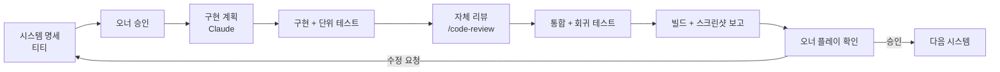

# 04. AI 개발 워크플로

| 항목 | 내용 |
|---|---|
| 문서 상태 | 사전 제작 조사 자료 (결정 문서 아님) |
| 작성 | Claude (개발 담당) |
| 작성일 | 2026-09-25 |
| 대상 도구 | VS Code, Claude Code, GitHub, 이미지·그래픽 생성 AI |

**표기 규칙:** [조사] 도구 사양·정책 / [권고] 개발 담당 의견 / [미정] 결정 대기

> 엔진이 [미정]이므로 이 문서는 엔진 중립 원칙을 기준으로 씁니다. 엔진별 차이가 있는 곳은 따로 표시합니다.

---

## 1. 역할 분담

| 주체 | 역할 | 산출물 |
|---|---|---|
| 프로젝트 오너 | 최종 승인, 단계 지시, 실제 플레이 테스트, 계정·결제·외부 계약 | 단계별 지시서, 승인·반려 |
| 티티 (ChatGPT) | 게임 기획, 시스템 규칙 설계 | 기획 문서, 시스템 명세 |
| Claude (Claude Code) | 기술 검토, 구현, 테스트, 저장소 관리 | 코드, 테스트, 기술 문서, 작업 보고 |
| 이미지·그래픽 AI | 컨셉 시안, 에셋 초안 | 생성 이미지 (사람의 검수·보정 필요) |

**원칙:** 명세가 없는 규칙은 구현하지 않습니다. 구현 중 명세의 빈 곳을 발견하면 임의로 채우지 않고, 질문 목록으로 기획 측에 돌려보냅니다.

---

## 2. 전체 흐름: 시스템 단위로 반복하기

게임 전체를 한 번에 생성하지 않고, 시스템 하나씩 **명세 → 구현 → 테스트 → 통합 → 플레이 확인**을 반복합니다.



### 2.1 시스템 명세 템플릿 [권고]

기획 측에서 시스템을 넘길 때 아래 형식을 쓰면 구현 중 해석 차이가 줄어듭니다.

```markdown
# 시스템명
## 목적 (플레이어가 무엇을 경험하는가)
## 확정 규칙 (번호 목록, 각 규칙은 검증 가능한 문장으로)
## 미정 사항 (구현 시 임시값으로 두고 표시할 것)
## 다른 시스템과의 연결 (입력 / 출력)
## 수용 기준 (이것이 되면 완료)
## 범위 밖 (이번에 하지 않는 것)
```

### 2.2 작업 단위 크기

- 한 번의 구현 작업은 **하루 안에 리뷰할 수 있는 크기**로 나눕니다. 예: "포커 전체"가 아니라 "덱·셔플·핸드 판정 로직과 테스트".
- 작업마다 브랜치 하나, 목적 하나를 둡니다.
- 수직 슬라이스(여러 시스템을 최소한으로 연결해 실제로 플레이 가능한 조각)를 초기에 만들어 통합 문제를 일찍 드러냅니다.

---

## 3. 프로젝트 구조 관리

### 3.1 저장소 구조 원칙 [권고]

구체적인 디렉터리는 엔진이 정해진 뒤에 만듭니다. 원칙은 다음과 같습니다.

```
docs/            기획·기술 문서 (현재 존재)
  preproduction/ 사전 제작 조사 (이 문서들)
  specs/         시스템 명세 (기획 측 산출물)
  adr/           기술 결정 기록 (결정 1건당 파일 1개)
game/            엔진 프로젝트 (엔진 확정 후 생성)
  systems/       시스템별 폴더. 폴더마다 코드 + 테스트 + README
  data/          게임 데이터 (코드와 분리)
  assets/        게임에 들어가는 최종 에셋
art-source/      원본 작업 파일 (.aseprite, .psd, .blend). LFS 대상
tools/           데이터 변환, 검증 스크립트
CLAUDE.md        AI 작업 규칙 (엔진 버전, 금지 사항, 코딩 규칙)
```

### 3.2 AI 작업 규칙 파일 (CLAUDE.md) [조사]

Claude Code는 저장소 루트의 `CLAUDE.md`를 매 세션 시작 시 읽습니다. 여기에 적을 내용은 다음과 같습니다.
- 고정된 엔진 버전 (AI가 다른 버전의 API를 섞어 쓰는 것을 막기 위해)
- 코딩 규칙 (타입 힌트 필수, 이름 규칙)
- 금지 사항 (명세 없는 규칙 구현, 원본 기획서 수정)
- 테스트·빌드 명령어
- 현재 진행 단계와 승인 상태

### 3.3 기술 결정 기록 (ADR) [권고]

"왜 이렇게 만들었는가"를 결정 1건당 짧은 문서로 남깁니다. AI는 세션이 바뀌면 이전 대화 맥락을 잃기 때문에, 저장소에 적힌 결정만이 다음 세션으로 이어지는 기억이 됩니다.

---

## 4. 코드 작성과 리뷰

| 단계 | 방법 | 도구 |
|---|---|---|
| 계획 | 구현 전에 변경 범위와 파일 목록을 먼저 제시 | Claude Code 계획 모드 |
| 작성 | 시스템 폴더 단위로 작성, 명세 규칙 번호를 주석이나 테스트 이름에 연결 | VS Code + Claude Code |
| 자체 리뷰 | 변경 내용(diff) 기준 버그·단순화 검토 | Claude Code `/code-review`, `/simplify` |
| 기록 | 작은 커밋, PR 설명에 명세 링크와 테스트 결과 첨부 | GitHub |
| 사람 검토 | 오너가 PR 요약과 스크린샷·영상으로 확인 | GitHub PR |

**AI 코드 작성의 알려진 약점 [조사]**
- 엔진 버전별 API를 혼동합니다(예: Godot 3과 4의 문법). 엔진 버전 고정과 CLAUDE.md 명시로 줄입니다.
- 코드는 그럴듯해도 실제 실행에서 실패할 수 있습니다. **실행 가능한 테스트가 유일한 확인 수단입니다.**
- 조작감, 연출 타이밍, 재미는 AI가 판단할 수 없습니다. 사람의 플레이 확인이 필수입니다.

---

## 5. 자동화 테스트

### 5.1 테스트 계층 [권고]

| 계층 | 대상 | 예시 | 실행 |
|---|---|---|---|
| 단위 테스트 | 엔진에 의존하지 않는 순수 로직 | 핸드 판정, 관계 수치 계산, 해금 조건 평가, 세이브 마이그레이션 | 매 커밋 |
| 데이터 검증 | 게임 데이터 파일 | ID 중복, 존재하지 않는 참조, 필수 필드 누락 | 매 커밋 |
| 시뮬레이션 테스트 | 긴 시간에 걸친 시스템 동작 | 30일 자동 진행 시 주민 막힘 여부, 포커 1만 판 자동 대전 시 능력 승률 분포 | 필요할 때, 주기적으로 |
| 통합 테스트 | 헤드리스로 씬 실행 | 씬 로드, 저장 → 불러오기 결과가 같은지 | PR마다 |
| 스크린샷 테스트 | 화면 결과 | 주요 화면을 캡처해 이전 결과와 비교하거나 AI가 직접 확인 | 필요할 때 |
| 플레이 테스트 | 사람 | 조작감, 재미, 가독성 | 단계 완료 시 |

**엔진별 도구 [조사]:** Godot은 GUT, gdUnit4, 헤드리스 실행(`--headless`). Unity는 Unity Test Framework와 batchmode.

### 5.2 테스트 가능한 구조 만들기 [권고]

- 무작위 요소는 시드를 넣을 수 있는 난수 생성기를 거치게 합니다(포커, 이벤트).
- 시간은 시간 시스템 하나만 거치게 합니다(03 문서 9절). 테스트에서 시간을 조작할 수 있어야 합니다.
- 게임 규칙 로직은 화면 노드와 분리합니다.

### 5.3 CI (GitHub Actions) [조사]

- 테스트 자동 실행과 빌드는 GitHub Actions로 할 수 있습니다.
- **현재 확인된 제약:** 이 PC의 GitHub CLI 토큰에는 `workflow` 스코프가 없습니다(`gist`, `read:org`, `repo`만 있음). 이 상태에서는 `.github/workflows/` 파일을 push할 수 없습니다. CI를 도입하려면 오너가 `gh auth refresh -s workflow`로 권한을 추가해야 합니다.

---

## 6. 게임 데이터와 코드 분리

**원칙:** 콘텐츠를 추가할 때 코드를 수정하지 않아도 되게 합니다.

| 데이터 종류 | 권장 형식 (후보) | 편집 주체 |
|---|---|---|
| 아이템, 가구, 수집품 | 스프레드시트 → CSV·JSON 내보내기 | 기획 측이 직접 편집 가능 |
| 주민 프로필, 스케줄 | JSON 또는 엔진 리소스 | 기획 측 초안 → 개발 측 반영 |
| 대사, 이벤트 | Yarn, Ink, 또는 전용 JSON | 기획 측 |
| 포커 능력 | 효과 정의 데이터 | 기획 측(수치), 개발 측(효과 종류) |
| 밸런스 수치 | 별도 설정 파일 | 기획 측 |
| 번역 텍스트 | 키-값 테이블(CSV, PO) | 번역 담당 |

**파이프라인 [권고]**
```
기획 측 스프레드시트/문서 → 내보내기 → tools/의 검증 스크립트 → game/data/ → 게임
```
- 검증 스크립트가 ID 중복과 잘못된 참조를 커밋 전에 잡아냅니다.
- 모든 콘텐츠에는 바뀌지 않는 문자열 ID를 붙입니다(예: `item.card_deck_moon`). 표시 이름은 번역 키로 따로 관리합니다.

---

## 7. 그래픽 에셋 관리

### 7.1 저장소 관리 [조사]

- 이미지, 3D 모델, 오디오 같은 바이너리 파일은 Git에서 diff가 불가능하고 저장소 용량을 빠르게 키웁니다. **Git LFS**로 관리하는 것이 일반적입니다.
- GitHub 공식 문서 기준 무료 플랜의 LFS 한도는 저장 10GB, 대역폭 월 10GB입니다. 한도를 넘으면 예산 설정에 따라 LFS 사용이 막히거나 과금됩니다. **작성일 기준이며 변동될 수 있습니다.**
- 이 저장소는 공개(public)입니다. 유료 에셋 팩이나 라이선스상 재배포가 금지된 에셋은 **공개 저장소에 올리면 라이선스 위반이 될 수 있습니다.** 에셋 보관 위치를 따로 정해야 합니다([미정]).

### 7.2 에셋 규칙 [권고]

- 원본 파일(`art-source/`)과 게임용 내보내기 결과(`game/assets/`)를 분리합니다.
- 이름 규칙 예: `분류_대상_변형_방향_프레임` (`char_villager01_walk_down_03.png`)
- 모든 에셋에 출처를 기록합니다. 형식은 `assets/CREDITS` 또는 에셋별 메타 파일이며, 기록할 항목은 아래와 같습니다.

| 기록 항목 | 이유 |
|---|---|
| 제작 방식 (직접, 에셋 팩, 외주, AI 생성) | Steam AI 공개 의무, 라이선스 관리 |
| 도구명·버전, 프롬프트 (AI 생성 시) | 스타일 재현, 공개 의무 |
| 라이선스, 상업 이용 가능 여부 | 출시 전 법적 검토 |
| 후보정 여부 | 저작권 판단 자료 |

### 7.3 AI 생성 에셋 관련 정책 [조사]

- Steam은 플레이어가 보거나 듣는 AI 생성 콘텐츠(그림, 음성, 대사, 번역, 마케팅 자료)를 공개하도록 요구합니다. 스토어 페이지에 표시됩니다. 2026년 1월 개정에서 **개발 효율용 도구(예: 코드 작성 보조)는 공개 대상에서 빠졌습니다.**
- 이미지 생성 AI의 상업 이용 조건은 도구마다 다르므로 도구별로 확인해야 합니다.

### 7.4 AI 이미지 생성의 현실적 활용 범위 [조사 + 권고]

| 용도 | 적합도 | 비고 |
|---|---|---|
| 컨셉 아트, 분위기 시안 | ◎ | 기획 단계의 스타일 탐색에 가장 유용 |
| 캐릭터 초상화, 일러스트 | ○ | 일관성 유지를 위해 기준 시트와 후보정이 필요 |
| 아이템 아이콘 | ○ | 크기·외곽선·조명 규칙을 맞추는 후처리 필요 |
| 타일셋 | △ | 이음새와 격자 정렬이 맞지 않는 경우가 많음 |
| 캐릭터 애니메이션 프레임 | ✕~△ | 프레임 간 형태 일관성이 약함 |
| 3D 모델 | △ | 소품 초안 수준. 리깅이 필요한 캐릭터에는 부적합 |

---

## 8. 버전 관리

| 항목 | 방식 [권고] |
|---|---|
| 브랜치 | `main`은 항상 실행 가능한 상태로 유지. 작업은 `feature/시스템-작업` 브랜치 |
| 커밋 | 작은 단위, 목적 하나. 현재 오너 설정은 "작업 완료 시 자동 커밋·push" |
| 병합 | PR을 통해 병합하고 PR에 테스트 결과를 기록 (1인 개발이라도 변경 이력 추적용) |
| 태그 | 플레이 테스트 빌드마다 태그(`playtest-001`) |
| 무시 목록 | 엔진 캐시(Godot `.godot/`, Unity `Library/`), 빌드 결과물, 개인 설정 |
| 엔진 설정 | Unity를 택하면 에셋 직렬화를 Force Text로, `.meta` 파일은 커밋 대상 |

**자동 push 정책과의 관계:** 현재 오너 설정은 작업 완료 시 자동 커밋·push입니다. 개발 단계가 시작되면 "기능 브랜치에 자동 push, `main` 병합은 승인 후"로 나누는 방식을 검토할 수 있습니다. 이 부분은 오너가 결정합니다([미정]).

---

## 9. PC와 모바일 테스트

| 환경 | 방법 | 제약 |
|---|---|---|
| Windows PC | 에디터 실행, 내보낸 빌드 실행 | 없음 |
| Steam (Steam Deck 포함) | Steamworks 파트너 계정의 비공개 브랜치 | 계정 등록과 비용이 선행되어야 함 |
| Android | USB 디버깅으로 기기에 바로 배포(Godot 원클릭 배포, Unity Build and Run) | Android SDK·JDK 설치 필요. 실기기 1대 이상 필요 |
| iOS | Xcode를 통해 기기에 배포 | **macOS 장비 필수.** 현재 환경에서는 불가능 |
| 해상도·비율 | 에디터에서 창 크기 바꾸기, 여러 비율로 스크린샷 자동 캡처 | 실제 기기의 터치감은 확인 불가 |

**AI가 할 수 있는 것과 없는 것**
- 할 수 있음: 빌드, 헤드리스 테스트, 스크린샷 캡처와 확인, 로그 분석, 연결된 Android 기기에 설치
- 할 수 없음: 터치 조작감, 발열·배터리 체감, 실제 플레이 재미 평가

---

## 10. 시스템 통합 시 충돌 방지

| 충돌 유형 | 원인 | 방지 방법 [권고] |
|---|---|---|
| 코드 의존 충돌 | 시스템끼리 직접 참조 | 이벤트 버스와 인터페이스로 연결. 시스템 README에 입출력 계약 기록 |
| 씬 파일 병합 충돌 | 같은 씬을 여러 작업에서 동시에 수정 | 씬을 작게 나누기. 한 작업이 한 씬만 소유 |
| 데이터 충돌 | 같은 데이터 파일을 동시에 수정 | 데이터 파일을 종류·주민별로 분할 |
| 세이브 호환성 충돌 | 시스템이 추가되면서 세이브 구조 변경 | 섹션별 버전 + 마이그레이션 테스트 |
| 규칙 충돌 | 두 시스템 명세가 서로 모순 | 통합 전에 명세끼리 교차 확인. 발견하면 기획 측에 질문 |
| 미완성 기능 노출 | 개발 중 기능이 빌드에 섞임 | 기능 플래그로 끄고 켜기 |

**통합 순서 [권고]:** 03 문서 0절의 의존 관계를 따라 기반 시스템부터 통합합니다. 의존도가 높은 시스템(주민 간 관계, 마을 발전)은 마지막에 붙입니다.

---

## 11. 추가 확인이 필요한 사항

- GitHub `workflow` 스코프 추가 여부 (CI 도입 시)
- 에셋 보관 위치: 공개 저장소 vs 비공개 저장소 분리
- 사용할 이미지 생성 AI 도구와 각 도구의 상업 이용 약관
- 자동 push 정책을 개발 단계에서도 유지할지 여부

## 출처

- [Git Large File Storage billing — GitHub Docs](https://docs.github.com/billing/managing-billing-for-git-large-file-storage/about-billing-for-git-large-file-storage)
- [Steam's 2026 AI Disclosure Rules — StraySpark](https://www.strayspark.studio/blog/steam-ai-disclosure-rules-2026-indie-developer-guide)
- [Steam AI Policy: What Every Game Developer Needs to Know](https://legalmoveslawfirm.com/steam-ai-policy/)
- [Unity MCP 시작하기 — Unity Docs](https://docs.unity3d.com/Packages/com.unity.ai.assistant@2.7/manual/integration/unity-mcp-get-started.html)
- [Godot AI — Godot Asset Store](https://store.godotengine.org/asset/dlight/godot-ai/)
