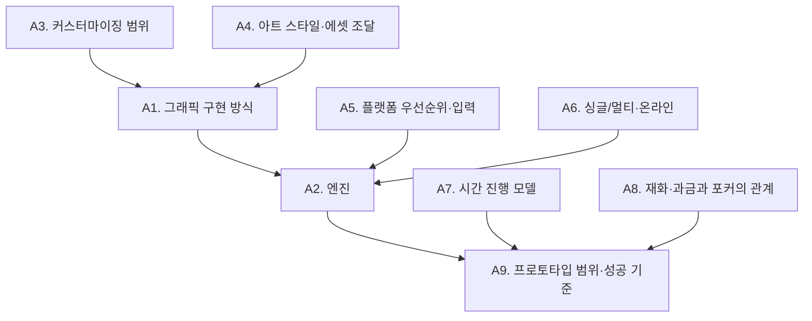

# 05. 기획 단계에서 결정해야 할 사항

| 항목 | 내용 |
|---|---|
| 문서 상태 | 사전 제작 조사 자료 (결정 문서 아님) |
| 작성 | Claude (개발 담당) |
| 작성일 | 2026-09-25 |
| 독자 | 티티 (기획 담당), 프로젝트 오너 |
| 근거 | 01~04 문서의 기술 검토 |

> 이 문서는 **질문과 선택지만** 정리합니다. 어떤 대안도 선택하지 않았습니다. 선택지 목록은 예시이며, 다른 대안을 택해도 됩니다.
> 기획서 1절에서 이미 확정된 사항(Q1~Q10)은 다시 묻지 않습니다. 그 범위 안의 세부만 다룹니다.

**분류 기준**
- **A. 개발 시작 전 필수:** 코드 구조, 엔진, 에셋 파이프라인을 결정합니다. 나중에 바꾸면 이미 만든 것을 다시 만들어야 합니다.
- **B. 프로토타입 중 결정 가능:** 구조는 열어 두고 시도해 보면서 정할 수 있습니다.
- **C. 플레이 테스트 이후 결정:** 수치와 체감의 문제입니다. 미리 정해도 결국 바뀝니다.

---

## 결정 순서 한눈에 보기

**우선순위:** A3·A4 → A1 → A5·A6 → A2 → A7·A8 → A9

---

## A. 개발 시작 전에 반드시 결정할 사항

### A1. 그래픽 기술 구현 방식

- **질문:** 마을 공간을 어떤 렌더링 구조로 표현할 것인가?
- **대안과 영향:**

| 대안 | 개발에 미치는 영향 |
|---|---|
| 2D 탑다운 | 기술 위험이 가장 낮고 모바일 대응이 쉽습니다. 파츠 커스터마이징과 가구 회전은 그림 수를 배로 늘립니다. |
| 2D 아이소메트릭 | 입체감이 있습니다. 하우징의 깊이 정렬과 회전 비용이 가장 큽니다. |
| 2.5D (3D 공간 + 2D 캐릭터) | 깊이감과 조명이 좋습니다. 3D 배경 제작 역량과 2D 캐릭터 제작 역량이 둘 다 필요합니다. |
| 스타일라이즈드 3D | 하우징·커스터마이징·회전이 자연스럽습니다. 3D 에셋 파이프라인(모델링, 리깅, 애니메이션)이 필수입니다. |

- **미뤘을 때의 문제:** 엔진 선택(A2)을 할 수 없습니다. 이동, 하우징, NPC, 카메라 코드가 모두 이 결정에 따라 달라지므로, 나중에 바꾸면 사실상 처음부터 다시 만들어야 합니다.
- 참고: [02 문서](02_GRAPHICS_TECHNICAL_OPTIONS.md)

### A2. 게임 엔진과 언어

- **질문:** 어떤 엔진과 언어로 개발할 것인가?
- **대안과 영향:**

| 대안 | 개발에 미치는 영향 |
|---|---|
| Godot 4 + GDScript | AI가 직접 다룰 수 있는 범위가 가장 넓고 비용이 없습니다. Steam 연동은 커뮤니티 플러그인에 의존하고, 3D 생태계는 약합니다. |
| Godot 4 + C# | 정적 타입의 이점이 있습니다. 웹 내보내기가 불가능하고 모바일은 실험 단계입니다. |
| Unity 6 + C# | 3D·모바일·에셋 생태계가 가장 강합니다. 에디터 의존도가 높고, 매출 $200K 초과 시 유료입니다. |
| GameMaker / Defold | 2D 한정입니다. 도구와 자료가 적어 직접 구현할 비중이 큽니다. |

- **미뤘을 때의 문제:** 코드 작성을 시작할 수 없습니다. 엔진을 중간에 바꾸면 코드, 씬, 에셋 가져오기 설정을 전부 다시 해야 합니다.
- **선행 결정:** A1, A5, A6
- 참고: [01 문서](01_ENGINE_AND_TECH_STACK.md)

### A3. 캐릭터 커스터마이징 범위

기획서 Q7에서 커스터마이징은 필수 코어로 확정되지 않았습니다.

- **질문:** 플레이어 캐릭터 외형을 어디까지 바꿀 수 있게 할 것인가? 주민 외형에도 같은 시스템을 쓸 것인가?
- **대안과 영향:**

| 대안 | 개발에 미치는 영향 |
|---|---|
| 없음 (고정 캐릭터) | 가장 저렴합니다. |
| 색상 변경만 | 모든 그래픽 방식에서 저렴합니다(셰이더). |
| 소수 파츠 교체 (예: 머리·옷 몇 종) | 2D에서는 파츠마다 전체 애니메이션을 그려야 합니다. 3D는 부담이 적습니다. |
| 대규모 파츠 조합 | 2D에서는 비용이 폭발적으로 늘어납니다. 사실상 3D나 2.5D를 전제로 해야 합니다. |

- **미뤘을 때의 문제:** 캐릭터 스프라이트 구조(한 장 그림 vs 레이어 분리)를 나중에 바꾸면 이미 그린 캐릭터 그림을 모두 다시 그려야 합니다.

### A4. 아트 스타일과 에셋 조달 방식

- **질문:** 어떤 스타일로 그릴 것이며, 에셋을 누가, 어떻게 만들 것인가?
- **대안과 영향:**

| 대안 | 개발에 미치는 영향 |
|---|---|
| 기성 에셋 팩 기반 | 빠르고 저렴합니다. 스타일을 팩에 맞춰야 합니다. 공개 저장소에 올릴 수 없는 라이선스가 많습니다. |
| AI 생성 + 사람 보정 | 컨셉과 아이콘에 유리합니다. 애니메이션과 타일셋 일관성이 약하고, Steam 공개 의무가 있습니다. |
| 외주 | 품질과 일관성이 좋습니다. 비용과 일정 관리가 필요합니다. |
| 직접 제작 | 오너의 제작 역량에 달려 있습니다. |
| 혼합 | 현실적인 선택이지만, 스타일 기준(해상도, 외곽선, 팔레트)을 문서로 정해 두어야 합니다. |

- **미뤘을 때의 문제:** 해상도, 타일 크기, 캐릭터 비율이 정해지지 않아 맵과 충돌 판정을 확정할 수 없습니다. 임시 그래픽으로 진행하더라도 **격자 크기와 캐릭터 기준 크기**는 먼저 정해야 합니다.

### A5. 플랫폼 우선순위와 입력 방식

기획서 4절: 출시 플랫폼과 우선 플랫폼은 [미정]입니다.

- **질문:** 첫 출시 플랫폼은 무엇이고, 모바일은 언제 어느 수준으로 대응할 것인가? 주 입력 방식은 무엇인가?
- **대안과 영향:**

| 대안 | 개발에 미치는 영향 |
|---|---|
| PC 전용 | 키보드·마우스·패드만 고려합니다. 나중에 모바일로 옮기면 UI와 조작을 크게 다시 만들어야 합니다. |
| PC 우선, 모바일을 고려한 설계 | 입력 추상화, 반응형 UI, 성능 예산을 처음부터 지킵니다. 초기 비용이 약간 늘어납니다. |
| PC·모바일 동시 | 두 플랫폼의 조작과 UI를 동시에 검증해야 합니다. 개발 속도가 가장 느립니다. |
| 모바일 우선 | 세로·가로 화면 방향, 짧은 플레이 세션, 과금 구조 등 설계 전반이 달라집니다. |

- **미뤘을 때의 문제:** UI 레이아웃, 상호작용 방식(탭 이동 여부), 성능 기준을 정할 수 없습니다. 특히 하우징 편집 UI와 포커 UI는 터치 여부에 따라 설계가 완전히 달라집니다.

### A6. 싱글/멀티플레이와 온라인 기능

기획서 4절: [미정]입니다.

- **질문:** 오프라인 싱글 게임인가? 방문, 협동, 대전, 온라인 이벤트 같은 온라인 요소가 있는가?
- **대안과 영향:**

| 대안 | 개발에 미치는 영향 |
|---|---|
| 오프라인 싱글 | 가장 단순합니다. 세이브는 로컬(+ Steam 클라우드)에 저장합니다. |
| 싱글 + 가벼운 온라인 (예: 마을 방문, 선물) | 서버 또는 플랫폼 서비스가 필요합니다. 세이브 위변조 대책이 필요해집니다. |
| 멀티플레이 포커 | 네트워크 동기화, 부정행위 방지, 서버 운영이 필요합니다. **사행성 규제 검토 범위도 커집니다.** |
| 온라인 필수 (라이브 서비스) | 서버, 운영, 보안 비용이 지속적으로 듭니다. 1인 개발 범위를 크게 넘습니다. |

- **미뤘을 때의 문제:** 저장, 시간, 포커, 인벤토리 구조가 모두 "로컬이 권위를 가지는가, 서버가 권위를 가지는가"에 따라 달라집니다. 싱글로 만든 뒤 멀티를 추가하는 것은 대부분 **재설계에 가깝습니다.**

### A7. 게임 내 시간 진행 모델

기획서 Q9: 쫓기지 않는 자유로운 생활, 낮·밤, 현실 날짜 연계 이벤트 가능성, 영구 소실 지양이 방향입니다. 실제 진행 로직은 [미정]입니다.

- **질문:** 게임 내 시간은 무엇에 의해 흐르는가? 게임을 끈 동안에도 흐르는가? 현실 날짜 이벤트를 넣는다면 어떤 방식으로 다시 경험할 수 있게 하는가?
- **대안과 영향:** [03 문서 9절](03_CORE_SYSTEM_FEASIBILITY.md#9-낮과-밤의-전환)의 표를 참고하세요. 게임 내 시계, 플레이어 주도 진행, 현실 시간 동기화, 혼합 방식이 있습니다.
- **미뤘을 때의 문제:** 주민 스케줄 데이터의 형식(분 단위 vs 시간대 단위)을 정할 수 없습니다. 이벤트 시스템과 세이브 구조도 확정할 수 없습니다. 스케줄 데이터를 만든 뒤 시간 모델을 바꾸면 모든 주민 스케줄을 다시 작성해야 합니다.

### A8. 재화·과금 구조와 포커의 관계

기획서 4절: 가상 재화와 과금·현금 관련 설계는 [미정]입니다.

- **질문:** 포커에 거는 대상은 무엇인가? 현금으로 살 수 있는 재화와 포커가 연결되는가? 판매 모델은 무엇인가?
- **대안과 영향:**

| 대안 | 개발에 미치는 영향 |
|---|---|
| 유료 판매(일회 구매), 포커는 비재화 또는 게임 내 재화만 사용 | 구조가 단순하고 등급 위험이 가장 낮습니다. |
| 유료 판매 + 추가 콘텐츠(DLC) | 콘텐츠 분리 구조가 필요합니다. |
| 무료 + 광고 | 광고 SDK 연동이 필요하고 모바일 중심 설계가 됩니다. |
| 무료 + 인앱결제 (포커 재화와 분리) | 결제 연동, 영수증 검증, 스토어 정책 준수가 필요합니다. |
| 인앱결제 재화를 포커에 사용 | **사행성 판정, 청소년이용불가 등급, 스토어 제한 위험이 큽니다.** 법률 자문이 필요합니다. |

- **미뤘을 때의 문제:** 등급 판정 결과에 따라 출시 가능한 시장과 연령층이 달라집니다. 포커 보상 구조, 수집·경제 시스템이 모두 이 결정 위에 서 있으므로 나중에 바꾸면 경제 설계 전체를 다시 해야 합니다.
- 참고: [03 문서 5절](03_CORE_SYSTEM_FEASIBILITY.md#5-캐주얼-포커와-판타지-능력) 등급·법규 위험

### A9. 첫 프로토타입의 범위와 성공 기준

기획서 4절: MVP 기능 목록과 수량은 [미정]이며, 이전 대화의 예시 수치는 확정 사항이 아닙니다.

- **질문:** 첫 번째로 플레이 가능한 버전에 무엇이 들어가며, 무엇을 확인하면 성공인가?
- **대안과 영향:**

| 대안 | 개발에 미치는 영향 |
|---|---|
| 핵심 반복 구조 검증형 (낮 생활 일부 + 밤 포커 일부 연결) | 게임의 정체성을 빠르게 검증합니다. 각 시스템은 최소한만 만듭니다. |
| 기술 검증형 (그래픽 방식·하우징·NPC 경로 확인) | 기술 위험을 먼저 없앱니다. 재미 검증은 뒤로 밀립니다. |
| 포커 단독 프로토타입 | 포커의 재미를 빠르게 검증합니다. 마을과의 연결은 검증하지 못합니다. |

- **미뤘을 때의 문제:** 개발 범위가 계속 늘어나고 완료 판단 기준이 없어집니다. 성공 기준이 없으면 프로토타입이 끝나지 않습니다.

---

## B. 초기 프로토타입 과정에서 결정해도 되는 사항

구조는 유연하게 만들어 두고, 실제로 시도해 보면서 정하는 항목입니다.

| # | 질문 | 선택지 예 | 개발 영향 | 미뤘을 때의 문제 |
|---|---|---|---|---|
| B1 | 포커 기본 룰은 무엇인가? | 표준 홀덤, 카드 수를 줄인 간소화 룰, 게임 고유 변형 | 룰 엔진은 교체할 수 있게 만들 수 있지만, 카드 UI 레이아웃은 룰에 따라 달라집니다. | 포커 프로토타입을 만들 수 없습니다. 프로토타입 시작 시점에는 임시 룰이라도 필요합니다. |
| B2 | 판타지 능력은 어떻게 얻고 사용하는가? | 판당 횟수 제한, 자원 소모, 주민별 고유 능력, 장착형 | 능력이 끼어드는 시점(훅) 설계가 달라집니다. | 룰 엔진의 훅 위치를 나중에 추가하면 리팩터링이 필요합니다. |
| B3 | 관계 상태를 어떤 모델로 표현하는가? | 단일 수치, 여러 축 수치, 단계형, 플래그 조합 | 대화 조건식과 세이브 구조가 됩니다. | 대사를 많이 쓴 뒤 바꾸면 조건을 모두 다시 써야 합니다. **대사를 대량 작성하기 전에 결정해야 합니다.** |
| B4 | 주민 스케줄을 얼마나 세밀하게 만드는가? | 시간대별 장소만, 장소 + 행동, 주민 간 상호작용 포함 | 행동 AI 구조(FSM, 행동 트리, 유틸리티 AI)를 고르는 기준이 됩니다. | 단순 구조로 시작해 나중에 복잡하게 바꾸면 행동 AI를 다시 짜야 합니다. |
| B5 | 주민 간 관계는 미리 짜 둘 것인가, 규칙으로 변하게 할 것인가? | 고정, 이벤트로만 변화, 규칙 기반 자동 변화, 혼합 | 자동 변화는 시뮬레이션 도구와 제약 규칙이 필요합니다. | 규칙 기반으로 늦게 전환하면 기존 이벤트와 모순이 생길 수 있습니다. |
| B6 | 하우징 배치 규칙은? | 격자 크기, 회전 허용 여부, 쌓기, 벽 부착, 야외 배치 | 격자 크기는 그림 크기와 연결됩니다. 회전은 2D에서 그림 수를 늘립니다. | 가구를 많이 만든 뒤 격자 크기를 바꾸면 가구 그림 전체를 다시 만들어야 합니다. |
| B7 | 실내외 전환 방식은? | 씬 전환(페이드), 끊김 없는 전환, 지붕 투명화 | 화면 밖 NPC 처리 방식이 달라집니다. | 끊김 없는 방식으로 늦게 바꾸면 맵 구조와 NPC 시스템을 다시 만들어야 합니다. |
| B8 | 카메라 시점과 줌은? | 고정, 제한 줌, 회전 허용(3D만) | UI 배치와 맵 가독성에 영향을 줍니다. | 영향이 비교적 작습니다. 맵 제작이 많이 진행된 뒤에는 가독성 문제가 생길 수 있습니다. |
| B9 | 저장 방식은? | 자동 저장만, 수동 슬롯, 자동 + 수동 | 세이브 UI와 저장 시점이 달라집니다. | 구조(섹션 + 버전)만 초기에 정해 두면 방식은 늦게 정해도 됩니다. |
| B10 | 대화 연출 방식은? | 말풍선, 대화창 + 초상화, 표정 변화, 음성(웅얼거림 포함) | 초상화를 쓰면 주민마다 표정 그림이 필요합니다. | 초상화를 늦게 추가하면 모든 대사에 표정 태그를 다시 달아야 합니다. |
| B11 | 도감·수집의 카테고리와 획득 경로는? | 포커 보상, 주민 선물, 상점, 탐색, 이벤트 | 아이템 DB 스키마(필드)가 달라집니다. | 필드를 나중에 추가하는 것은 쉽지만 ID 체계는 초기에 정해야 합니다. |
| B12 | 놓친 이벤트를 어떻게 다시 경험하게 하는가? (Q9 방향 안에서) | 재방문 이벤트, 대체 획득 경로, 회상 기능 | 이벤트 경험 여부 저장과 재실행 구조가 필요합니다. | 이벤트를 많이 만든 뒤 적용하면 이벤트마다 재접근 경로를 따로 붙여야 합니다. |

---

## C. 실제 플레이 테스트 이후 결정해야 하는 사항

미리 숫자를 정해도 플레이 테스트 후 바뀌는 항목입니다. **개발 측은 이 값들을 모두 데이터 파일로 분리해서 코드 수정 없이 조정할 수 있게 만듭니다.**

| # | 질문 | 조정 대상 | 미리 확정했을 때의 문제 |
|---|---|---|---|
| C1 | 포커 한 판은 얼마나 걸려야 하는가? | 라운드 수, 시작 칩, 블라인드 상승 [룰에 따라] | 체감과 다르면 "짧고 캐주얼한" 방향(Q5)을 벗어납니다. |
| C2 | 능력의 강도와 사용 제한은? | 효과 수치, 쿨다운, 횟수 | 자동 대전 시뮬레이션만으로는 체감 밸런스를 알 수 없습니다. |
| C3 | AI 상대는 얼마나 강해야 하는가? | 성격별 공격성, 블러프 빈도, 실수 확률 | 너무 강하면 캐주얼함이 사라지고, 너무 약하면 긴장감이 사라집니다. |
| C4 | 관계는 얼마나 빨리 진전되어야 하는가? | 상승·하락 폭, 단계별 기준값 | 너무 빠르면 목표가 사라지고, 너무 느리면 반복 노동이 됩니다. |
| C5 | 마을 발전 속도와 해금 순서는? | 해금 조건 수치, 순서 | "강제 일과 최소화" 방향(기획서 2절)과 동기 부여 사이의 균형 문제입니다. |
| C6 | 낮과 밤의 길이는? (게임 내 시계를 택한 경우) | 시간 배율 | "쫓기지 않는" 체감은 실제로 해 봐야 알 수 있습니다. |
| C7 | 초기 주민 수와 콘텐츠 양은? | 주민 수, 주민당 대사·이벤트 수 | 제작 비용이 선형(대사) 또는 제곱(주민 간 관계)으로 늘어나므로, 한 명당 제작 비용을 측정한 뒤 정하는 것이 안전합니다. |
| C8 | 모바일 UI 세부 배치는? | 버튼 크기, 위치, 한 손 조작 여부 | 실제 기기에서 테스트하지 않고 정한 배치는 대부분 바뀝니다. |
| C9 | 재화 획득량과 가격은? | 보상량, 상점 가격, 가구 가격 | 경제는 플레이 데이터 없이 맞추기 어렵습니다. |

---

## 다음 단계 제안 [권고]

1. 기획 측이 **A3(커스터마이징 범위)과 A4(아트 방향)**를 먼저 정하면 A1(그래픽 방식)의 선택지가 좁혀집니다.
2. A1, A5, A6이 정해지면 개발 측이 엔진(A2)에 대한 최종 기술 의견을 제출합니다.
3. A7, A8, A9가 정해지면 첫 프로토타입 명세를 작성할 수 있습니다.
4. A8(재화·과금과 포커)은 기획 결정과 별개로 **법률·등급 자문을 병행**하기를 권고합니다.
